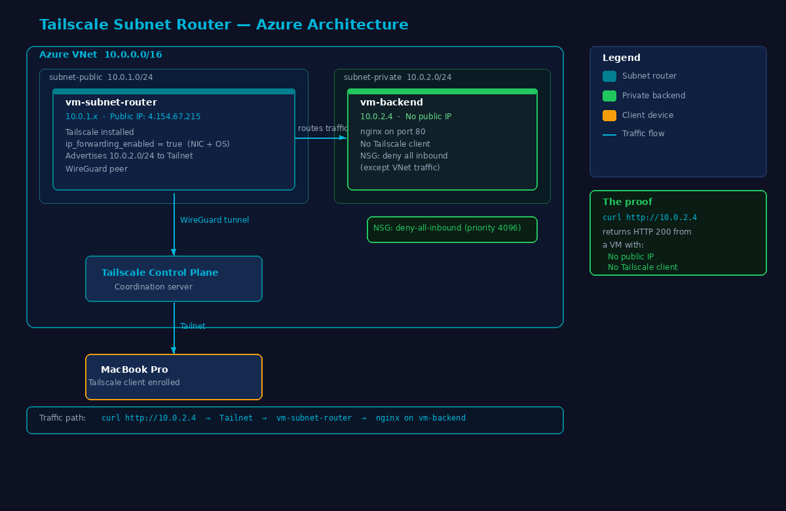
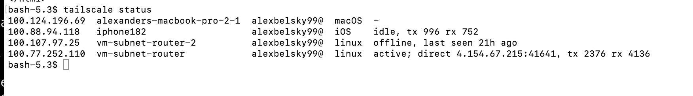
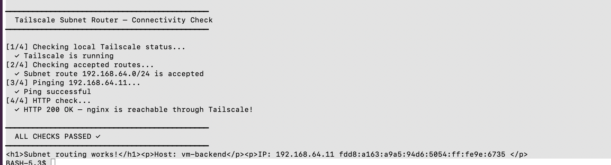

# Tailscale Subnet Router — Azure + Terraform

A fully automated, Infrastructure-as-Code deployment of a Tailscale subnet router on Microsoft Azure. This project provisions two Ubuntu VMs in an Azure VNet, installs Tailscale on a subnet router VM, and exposes a private nginx backend through the Tailnet — no public IP on the backend, no open inbound ports, no manual configuration beyond route approval.

---

## Architecture

The backend VM is only reachable by devices enrolled in the Tailnet via the subnet router. It has no public IP and no internet-facing ports. The NSG explicitly denies all inbound traffic except from within the VNet.

---

## Validation Output

All 4 checks pass end-to-end:
- Tailscale running locally and enrolled in Tailnet
- Subnet route 10.0.2.0/24 accepted in Tailnet admin console
- ICMP ping to backend via subnet router
- HTTP 200 from nginx on private VM via curl http://10.0.2.4

---

## Prerequisites

| Requirement | Notes |
|---|---|
| Azure subscription | Free tier works |
| Terraform >= 1.5 | Via Azure Cloud Shell (pre-installed) |
| Tailscale account | Free tier works |
| Tailscale API key | Generate at https://login.tailscale.com/admin/settings/keys |
| SSH public key | For VM access |

---

## Quick Start

### 1. Clone and configure

    git clone https://github.com/alexbelsky99-ui/Azure-Test.git
    cd Azure-Test/terraform
    cp terraform.tfvars.example terraform.tfvars

Edit terraform.tfvars:

    tailscale_api_key    = "tskey-api-..."
    tailscale_tailnet    = "you@gmail.com"
    admin_ssh_public_key = "ssh-rsa ..."

### 2. Deploy

    terraform init
    terraform apply -auto-approve

Takes 3-5 minutes. Creates 14 Azure resources including VNet, subnets, NSGs, public IP, NICs, and two VMs configured via cloud-init.

### 3. Approve the advertised route (one-time)

Go to https://login.tailscale.com/admin/machines, find vm-subnet-router, click Edit route settings, toggle on 10.0.2.0/24, click Save.

### 4. Validate

    tailscale up --accept-routes
    curl http://10.0.2.4

### 5. Tear down

    terraform destroy -auto-approve

---

## Design Choices

### Azure for production-grade topology

Azure was chosen to provide real network isolation identical to an enterprise environment. The VNet with public and private subnets means the backend VM is genuinely unreachable from the internet — not just logically separated. This reflects how Tailscale customers actually deploy subnet routers in production.

### IaC: Terraform with azurerm provider

Terraform manages all 14 Azure resources — resource group, VNet, subnets, NSGs, public IP, NICs, NSG associations, Tailscale auth key, and both VMs. The official Tailscale Terraform provider creates the pre-auth key programmatically so the subnet router VM joins the Tailnet automatically at first boot. The entire deployment is a single terraform apply.

### cloud-init for VM configuration

Rather than post-deployment scripts, cloud-init configures both VMs at first boot. The subnet router cloud-init installs Tailscale, sets net.ipv4.ip_forward=1 via sysctl, and runs tailscale up with the advertise-routes flag. By the time terraform apply completes, the VM is already enrolled in the Tailnet.

### Backend service: nginx

nginx was chosen as a simple, universally recognizable proof-of-connectivity target. The cloud-init script renders a page showing the VM hostname and private IP, making it immediately obvious that you have reached the correct private endpoint through the Tailnet.

### Key design decision: IP forwarding at two levels

Azure requires IP forwarding to be enabled at two levels: the NIC resource (ip_forwarding_enabled=true in Terraform) AND the OS (net.ipv4.ip_forward=1 via sysctl in cloud-init). Without both, Tailscale connects perfectly but subnet traffic is silently dropped with no error. This is the most common mistake in Azure subnet router deployments.

---

## Validation

The validation tests the full path end-to-end:

1. Tailscale status — confirms local client is enrolled and running
2. Route acceptance — confirms 10.0.2.0/24 is visible and accepted in the Tailnet
3. ICMP ping — confirms Layer 3 reachability through the subnet router
4. HTTP curl — confirms nginx is serving traffic on the private VM

The key proof: the backend VM has no Tailscale client, no public IP, and its NSG denies all inbound traffic from the internet. A successful curl http://10.0.2.4 proves the full routing chain — MacBook -> Tailnet -> subnet router -> private VM — is working.

---

## Reflection and AI Disclosure

Used Claude (Anthropic) as a reference during development — primarily to validate my Terraform syntax and sanity-check my approach. All architecture decisions, debugging, and deployment were my own. All code was reviewed and validated through a complete live deployment. I believe being transparent about AI tool usage is important — particularly for a Solutions Engineer role where helping customers adopt new technology effectively is the core job.

---

## Alternatives and Future Improvements

### Route auto-approval via ACL

Rather than manually approving routes in the admin console, add an autoApprovers block to your tailnet ACL policy:

    {
      "autoApprovers": {
        "routes": {
          "10.0.2.0/24": ["tag:subnet-router"]
        }
      }
    }

### Tailscale SSH

Replace the SSH key setup with Tailscale SSH to eliminate key management entirely and remove the need for any open ports.

### Redundant subnet routers

Deploy two subnet router VMs in different Azure availability zones. Tailscale automatically fails over between multiple routers advertising the same subnet.

### Tailscale Funnel

Use Tailscale Funnel to expose the nginx backend over HTTPS to the public internet without opening any firewall rules or modifying the NSG.

### Multi-region deployment

Deploy the same pattern in multiple Azure regions with VNet peering. The same Terraform structure applies — only the location variable changes.

---

## Tailnet

alexbelsky99@gmail.com

---

## Repository Structure

    Azure-Test/
    +-- terraform/
    |   +-- providers.tf                  # azurerm + tailscale providers
    |   +-- variables.tf                  # input variables with defaults
    |   +-- main.tf                       # 14 Azure resources
    |   +-- outputs.tf                    # IPs, SSH command, curl command
    |   +-- terraform.tfvars.example      # copy to terraform.tfvars
    |   +-- templates/
    |       +-- subnet-router-init.yaml.tpl
    |       +-- backend-init.yaml
    +-- scripts/
    |   +-- validate.sh                   # end-to-end connectivity check
    +-- validation-screenshot.png         # proof of connectivity
    +-- .gitignore
    +-- README.md
